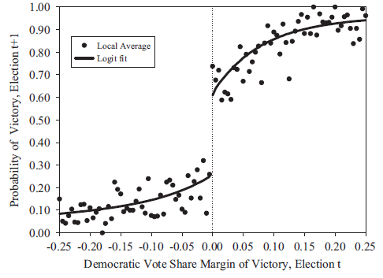
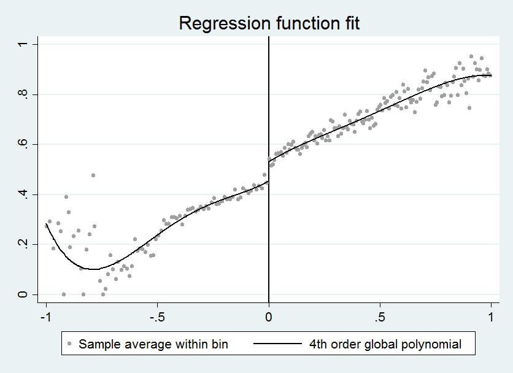

```{r Setup, include=FALSE, results='hide', warning=FALSE}

library(devtools)

opts_chunk$set(fig.path="assets/fig/",
               cache.path="./cache/",
               dev=c("png","pdf"),
               dpi=300,
               fig.show="hold",
               fig.lp="fig:",
               cache=FALSE,
               par=TRUE,
               echo=TRUE,
               message=FALSE,
               warning=FALSE)

```

### Regression Discontinuity Designs

#### Advanced applied statistics, 2015

##### Erik Gahner Larsen

---

## Agenda

- Experiments and natural experiments

- Regression discontinuity designs

- How to do it in R and STATA

---

### Last week

- Causal inference and observational studies

- Use of matching methods to create overlap and balance between treatment and control group

- Estimate average treatment effects and average treatment effects on the treated

---

### Natural experiments

"Katrina was an act of nature that was close to what a political scientist would have liked to have done if he or she could - intervening and changing the political makeup of several large U.S. cities such as New Orleans, Houston, and Atlanta." (Morton and Williams [2010](http://www.cambridge.org/us/academic/subjects/politics-international-relations/research-methods-politics/experimental-political-science-and-study-causality-nature-lab), 53)

---

### How are natural experiments different from traditional experiments?

"However, unlike true experiments, the data used in natural experiments come from "naturally" occurring phenomena - actually, in the social sciences, from phenomena that are often the product of social and political forces. Because the manipulation of treatment variables is not generally under the control of the analyst, natural experiments are, in fact, observational studies." (Dunning [2012](http://www.cambridge.org/us/academic/subjects/politics-international-relations/research-methods-politics/natural-experiments-social-sciences-design-based-approach), 16)

---

"Although natural experiments offer significant advantages, they do not possess key benefits of actual experiments and hence require careful theoretical and statistical work to make valid inferences." (Sekhon and Titiunik [2012](http://journals.cambridge.org/action/displayAbstract?fromPage=online&aid=8504677&fileId=S0003055411000542), 53)

---

"Without an experiment, a natural experiment, **a discontinuity**, or some other strong design, no amount of econometric or statistical modeling can make the move from correlation to causation persuasive." (Sekhon [2009](http://www.annualreviews.org/doi/abs/10.1146/annurev.polisci.11.060606.135444), 503)

---

### Do we need an overlap to make causal inferences?

- No, we can even utilize the lack of overlap

- A lack of overlap can sometimes be explained by a covariate that assign treatment to units: "Regression discontinuity is an approach for dealing with this extreme case of lack of overlap in which the assignment mechanism is clearly defined" (Gelman and Hill [2007](http://www.cambridge.org/us/academic/subjects/statistics-probability/statistical-theory-and-methods/data-analysis-using-regression-and-multilevelhierarchical-models), 212)

- So, today: Regression discontinuity designs (RDD)

---

### Regression discontinuity designs in a nutshell

- An identification strategy that creates treatment and control groups by utilizing instances where continuous variables are made into categorical variables due to clear cutoff values

- Units scoring above/below a cutoff point in assigned to the treatment/control group

- Treatment assignment is a deterministic function of a forcing variable (assignment by rule, not randomization)

- As-if randomness in the window around the cutoff point

- Treatment effect: Difference in outcome variable between units _just_ above and _just_ below the cutoff point

---

### Forcing variable

```{r echo = FALSE, warning = FALSE, fig.width=9, fig.height=6}
library("ggplot2")

df <- data.frame(x = 1:100)
df$y.0 <- ifelse(df$x < 50, 0, NA)
df$y.1 <- ifelse(df$x >= 50, 1, NA)
df$y <- ifelse(!is.na(df$y.1), df$y.1, df$y.0)

ggplot(df, aes(x, y)) + 
  geom_line(aes(x[y.0==0],y[y.0==0]), size=1, col="red") +
  annotate("text", x = 25, y = 0.1, label = "Untreated") +
  geom_line(aes(x[y.1==1],y[y.1==1]), size=1, col="blue") +
  annotate("text", x = 75, y = 0.9, label = "Treated") +
  geom_vline(xintercept=50, linetype="dashed", col="gray70") +
  scale_y_continuous("Treatment", breaks=c(0,1)) +
  xlab("Forcing variable") +
  theme_minimal(base_size = 18) +
  theme(panel.grid.major = element_blank())
```

---

### Example: Vote share, two party system

```{r echo = FALSE, warning = FALSE, fig.width=9, fig.height=6}
library("ggplot2")

df <- data.frame(x = 1:100)
df$y.0 <- ifelse(df$x < 50, 0, NA)
df$y.1 <- ifelse(df$x >= 50, 1, NA)
df$y <- ifelse(!is.na(df$y.1), df$y.1, df$y.0)

ggplot(df, aes(x, y)) + 
  geom_line(aes(x[y.0==0],y[y.0==0]), size=1, col="red") +
  annotate("text", x = 25, y = 0.1, label = "Untreated") +
  geom_line(aes(x[y.1==1],y[y.1==1]), size=1, col="blue") +
  annotate("text", x = 75, y = 0.9, label = "Treated") +
  geom_vline(xintercept=50, linetype="dashed", col="gray70") +
  scale_y_continuous("Pr(Incumbency)", breaks=c(0,1)) +
  xlab("Vote share (%)") +
  theme_minimal(base_size = 18) +
  theme(panel.grid.major = element_blank())
```

---

"In a regression-discontinuity design, treatment assignment is determined by the value of a covariate, sometimes called a forcing variable, and there is a sharp discontiniuity in the probability of receiving treatment at a particular threshold value of this covariate" (Dunning [2012](http://www.cambridge.org/us/academic/subjects/politics-international-relations/research-methods-politics/natural-experiments-social-sciences-design-based-approach), 64)

---

### Sharp and fuzzy regression discontinuities

- Two types of RDD:
  - Sharp (SRD): _All_ units with a score above a cutoff is assigned to treatment
  - Fuzzy (FRD): Propensity to be treated increases at cutoff point. Compliance with treatment is imperfect (not fully determined treatment assignment). Think of the ITT estimator.

- We will focus on sharp RDDs. 

---

### RDD in the Neyman-Rubin causal model

- We are (still) interested in potential outcomes to define causal effects

- For individual _i_, we have a potential outcome: $Y_{i}$

- Treatment: $W_{i}$

- Potential outcome given treatment status: $Y_{i}(W_{i})$

- Two potential outcomes: $Y_{i}(1), Y_{i}(0)$

- Forcing variable: $X_{i}$ (covariate, running variable)

- Cutoff value: $c$ (discontinuity)

- Treatment assignment given by:

$W_{i} = \begin{cases} W_{i} = 1  & if X_{i} \geq c \\  W_{i} = 0 & if X_{i} < c \end{cases}$

---

### Average treatment effects

- FPCI: We only observe the outcome under treatment or control for each unit. We never observe both units for the same value of $X_{i}$.

- $X_{i}$ is often correlated with $Y_{i}$. Simply comparing treatment and control does not provide causal estimates!

- We use the discontinuity in $E[Y_{i}|X_{i}]$ at the cutoff value $X_{i} = c$ to estimate the effect of $W_{i}$ on $Y_{i}$.

---

### Average treatment effect

- Extrapolation
  - The extrapolation is a counterfactual (potential outcome)
  - Below cutoff point: only non-treated observations
  - Above cutoff point: only treated observations
  
- Treatment effects are often local
  - _Local_ average treatment effect (LATE)
  - Identified at the cutoff point

$$\tau = \lim_{x \downarrow c} E[Y(1)|X=c] - \lim_{x \uparrow c} E[Y(0)|X=c]$$

---

```{r echo = FALSE, warning = FALSE, fig.width=9, fig.height=6}
df <- data.frame(x = (1:1000)/10)
df$y <- df$x / 3
df$z <- ifelse(df$x < 50, "red", "blue")

ggplot(df, aes(x, y)) + 
  geom_line(color=as.factor(df$z), size=1) +
  geom_vline(xintercept=50, linetype="dashed", col="gray70") +
  xlab("Forcing variable") +
  scale_y_continuous("Outcome (Y)", limits=c(0,45), breaks=c(0,10,20,30,40)) +
  theme_minimal(base_size = 18) +
  theme(panel.grid.major = element_blank())

```

---

```{r echo = FALSE, warning = FALSE, fig.width=9, fig.height=6}
df <- data.frame(x = (1:1000)/10)
df$y <- df$x / 3
df$y.1 <- ifelse(df$x >= 50, (df$x / 3), NA)
df$y.0 <- ifelse(df$x < 50, df$x / 3, NA)
df$z <- ifelse(df$x < 50, "red", "blue")

ggplot(df, aes(x, y)) + 
  geom_line(aes(x[y.0>=0],y[y.0>=0]), size=1, col="red") +
  geom_line(aes(x[y.1>=0],y[y.1>=0] + 10), size=1, col="blue") +
  geom_vline(xintercept=50, linetype="dashed", col="gray70") +
  xlab("Forcing variable") +
  scale_y_continuous("Outcome (Y)", limits=c(0,45), breaks=c(0,10,20,30,40)) +
  theme_minimal(base_size = 18) +
  theme(panel.grid.major = element_blank())

```

---

```{r echo = FALSE, warning = FALSE, fig.width=9, fig.height=6}
ggplot(df, aes(x, y)) + 
  geom_line(aes(x[y.0>=0],y[y.0>=0]), size=1, col="red") +
  geom_line(aes(x[y.1>=0],y[y.1>=0]), size=1, linetype="dashed", col="blue", alpha=.3) +
  geom_line(aes(x[y.1>=0],y[y.1>=0] + 10), size=1, col="blue") +
  geom_vline(xintercept=50, linetype="dashed", col="gray70") +
  xlab("Forcing variable") +
  scale_y_continuous("Outcome (Y)", limits=c(0,45), breaks=c(0,10,20,30,40)) +
  theme_minimal(base_size = 18) +
  theme(panel.grid.major = element_blank())

```

---

```{r echo = FALSE, warning = FALSE, fig.width=9, fig.height=6}
ggplot(df, aes(x, y)) + 
  geom_line(aes(x[y.0>=0],y[y.0>=0]), size=1, col="red") +
  geom_line(aes(x[y.0>=0],y[y.0>=0] + 10), size=1, linetype="dashed", col="red", alpha=.3) +  
  geom_line(aes(x[y.1>=0],y[y.1>=0]), size=1, linetype="dashed", col="blue", alpha=.3) +
  geom_line(aes(x[y.1>=0],y[y.1>=0] + 10), size=1, col="blue") +
  geom_vline(xintercept=50, linetype="dashed", col="gray70") +
  xlab("Forcing variable") +
  scale_y_continuous("Outcome (Y)", limits=c(0,45), breaks=c(0,10,20,30,40)) +
  theme_minimal(base_size = 18) +
  theme(panel.grid.major = element_blank())

```

---

### Bandwidth choice

- Bandwidth ($h$): the width of the window of observations used to estimate LATE

- Limit the sample:

$c - h \leq X_{i} \leq c + h$

- Lower bandwidth lowers the risk of bias but reduces the number of observations (Green et al. [2009](http://pan.oxfordjournals.org/content/17/4/400.short); Robinson et al. [2009](http://pan.oxfordjournals.org/content/17/4/341.abstract)).

---

### As-if randomness around cutoff point

- The procedure:
  1. Decide on bandwidth
  2. Treat the data as an experiment

- Problems:
  1. Arbitrary bandwidth selection
  2. Biased estimates if not random

- Suggestions:
  1. Robustness tests (Imbens and Lemieux [2008](http://www.sciencedirect.com/science/article/pii/S0304407607001091), 622)
  2. DID, matching

---

### Examples of forcing variables

- The forcing variable can be: Vote share in an election, birthdate/age, income, population thresholds, score on a test, geographical distance, stock returns, classroom size, voter numbers

- Forcing variables are especially applicable in a rule based world, e.g. elections and policies (what we care about)

- What is a good forcing variable?

---

### Robustness tests

- $\uparrow$ Model specification choices $\rightarrow$ $\uparrow$ Researcher degrees of freedom

- Are the results sensitive to alternative model specifications?
  - Functional form, nonparametric estimation, local-polynomial order
  - Bandwidth 
  
- Make all the robustness tests you can (appendix material)

- On a practical note: reproduce with different packages and statistical software

---

### Covariates

- Covariates should not affect the estimate of the treatment effect
  
- Covariates should be random around the discontinuity
  - Remember: as-if random

- Balance checks: Is there a discontinuity for other covariates at the cutoff point?

- What kind of balance checks? RDD estimates, and see the procedures introduced last week

---

### Placebo tests

- Placebo cutoffs. Create other cutoff values and estimate the treatment effect

- Do we observe similar "jumps" as at the cutoff value? 
  - Similar LATE: Serious problem. Seriously.
  - No LATE at placebo cutoffs: Less of a problem, but no guarantee (only absence of evidence)

---

### Sharpness

- We want _sharp_ discontinuities

- Estimates can be invalid if individuals can precisely manipulate the assignment (Lee and Lemieux [2010](https://www.aeaweb.org/articles.php?doi=10.1257/jel.48.2.281), 283)

- Lack of sharpness can result from:
  - measurement error in forcing variable
  - strategic behavior, manipulation of the running variable

- Forcing variable might not be that "forcing"

- FRD, estimate ITT, IV-estimation (next week)

- Units might exploit the discontinuity (i.e. knowledge about cutoff among units can lead to biased effects)

---

### Sorting

- Do units sort around the cutoff?

- The LATE will be biased if units (or other persons) strategically manipulate values to fall above or below cutoff

- Look at the distribution of $X_{i}$ at the cutoff (do people sort to the right or left?)

---

#### RDD recommendations (Eggers et al. [2015](http://onlinelibrary.wiley.com/doi/10.1111/ajps.12127/abstract))

1. Consider theoretical mechanisms that could produce sorting around the discontinuity.

2. Evaluate balance on pretreatment covariates and especially on the lagged outcome variable, focusing on the presence or absence of substantively large imbalances in characteristics that might be related to the mechanisms that could produce sorting. These tests should employ the same specifications as those employed to estimate the effects of interest, and these specifications should account for the potential relationship between the running variable and the outcome variable.

3. Present estimates at a number of alternative bandwidths and specifications.

---

### Example: Thistlethwaite and Campbell ([1960](http://psycnet.apa.org/journals/edu/51/6/309))

- First application of RDD

- The impact of merit awards (scholarships, $W_{i}$) on future academic outcomes ($Y_{i}$)

- Awards assigned based on SAT test scores ($X_{i}$)

- Score just above $c$ $\rightarrow$ award

- What if we study the correlation between $X_{i}$ and $Y_{i}$?

---

### Example: Thistlethwaite and Campbell ([1960](http://psycnet.apa.org/journals/edu/51/6/309))

- Confoundedness: $X_{i}$ is correlated with $Y_{i}(0)$ and $Y_{i}(1)$
  - Higher score $\rightarrow$ higher earnings, higher college grades

- Solution: Compare observations _just_ above and _just_ below the score cutoff point

- $E[Y_{i}(1)|X_{i}]$ and $E[Y_{i}(0)|X_{i}]$ are continuous functions of $X_{i}$ at $X_{i} = c$

- Discontinuity in $E[Y_{i}|X_{i}]$ at $X_{i} = c$ 
  - Treatment group ($W_{i}(1)$): Above cut-off and did receive award
  - Control group ($W_{i}(0)$): Below cut-off and **did not** receive award
  - Impact of award receipt for persons near the cutoff

---

### Example: Spanish-language ballots 

- Hopkins ([2011](http://onlinelibrary.wiley.com/doi/10.1111/j.1540-5907.2011.00534.x/abstract)): Translating into Votes: The Electoral Impacts of Spanish-Language Ballots

- Question: What is the impact of language assistance on voter turnout among Latino citizens? 
  - Why not simply study correlation between $X_{i}$ and $Y_{i}$?

- Forcing variable: U.S. counties with a language minority +10,000 citizens must provide Spanish-language ballots (Voting Rights Act)

- Forcing variable ($X$): Population size of the language minority in each county 

- Cutoff value ($c$): 10,000. Treatment ($W_{i}$): presence of Spanish-language ballots.

---


---

### Example: Party incumbency advantage 

- Lee ([2008](http://www.sciencedirect.com/science/article/pii/S0304407607001121)): Randomized experiments from non-random selection in U.S. House elections

- Question: How big is the party incumbency advantage?

- Design: RDD. Democratic vote share where democratic candidates almost won or lost the previous election.

- Data: Elections to the U.S. House of Representatives (1946 to 1998)

---



---

- Grimmer et al. ([2011](http://web.stanford.edu/~jgrimmer/CEF.pdf)): Gubernatorial and State House control is correlated with winning close elections for the U.S. House

- Caughey and Sekhon ([2011](http://pan.oxfordjournals.org/content/19/4/385.abstract)): Covariate imbalances between near winners and losers.

- Eggers et al. ([2015](http://onlinelibrary.wiley.com/doi/10.1111/ajps.12127/abstract)): No systematic evidence of sorting or imbalance around electoral thresholds.

- For more: See Hainmueller et al. ([2015](http://polmeth.wustl.edu/media/Paper/HHSrdd_1_2.pdf)) and de la Cuesta and Imai ([2016](http://imai.princeton.edu/research/files/RD.pdf)).

---

## The validity of RDD

- Strong internal validity (Cook and Wong [2008](http://www.jstor.org/stable/27917242); Dunning [2012](http://www.cambridge.org/us/academic/subjects/politics-international-relations/research-methods-politics/natural-experiments-social-sciences-design-based-approach); Berk [2010](http://link.springer.com/referenceworkentry/10.1007%2F978-1-4614-5690-2_295), 574)

- Less external validity (Imbens and Lemieux [2008](http://www.sciencedirect.com/science/article/pii/S0304407607001091), 622)

- Less conclusion validity
  - Lower power
  - Requires large N to estimate same effect

---

## RDD in R and STATA

- Multiple packages for R (`rddtools`, `rdrobust` etc.)

- A lot of options (kernel density, bandwidth selection, local-polynomial order etc.)

- We will focus on the basics

---

### RDD in R (`rddtools`)

```{r warning=FALSE, eval=FALSE}
# Load rddtools package
library("rddtools")

# Use data from Lee (2008) 
data(house)

# Set outcome, forcing and cutoff variable
house_rdd <- rdd_data(y=y, x=x, cutpoint=0, data=house)

# Estimate RDD
reg_para <- rdd_reg_lm(rdd_object=house_rdd)

# Print results
print(reg_para)
```

---

### RDD in R (`rddtools`)

```{r warning=FALSE, echo=FALSE}
# Load rddtools package
library("rddtools")

# Use data from Lee (2008) 
data(house)

# Set outcome, forcing and cutoff variable
house_rdd <- rdd_data(y=y, x=x, cutpoint=0, data=house)

# Estimate RDD
reg_para <- rdd_reg_lm(rdd_object=house_rdd)

# Print results
print(reg_para)
```

---

### RDD in R (`rddtools`)

```{r}
plot(reg_para)
```

---

### RDD in R (`rddtools`)

```{r}
# Restrict sample to bandwidth area
bw_ik <- rdd_bw_ik(house_rdd)
reg_para_ik <- rdd_reg_lm(rdd_object=house_rdd, bw=bw_ik)
reg_para_ik
```

---

### RDD in R (`rddtools`)

```{r}
plot(reg_para_ik)
```

---

### RDD in R (`rdrobust`)

```{r}
# Load rdrobust package
library("rdrobust")

# Estimate effect
rdrobust(house$y, house$x)
```

---

### RDD in R (`rdrobust`)

```{r}
rdplot(house$y, house$x)
```

---

### RDD in STATA (`rdrobust`)

- `rdrobust` is also available in STATA

- Can be installed via `ssc install` but the easy way is just to go through: 

`. findit rdrobust`

- RDD estimate: 
  
  `. rdrobust y x, c(0) bwselect(IK) all`
  
- RDD plot: 
  
  `. rdplot y x, c(0) bwselect(IK)`

---

# WARNING!

STATA plot on next slide

---



---

### Conclusion

- Three components: Outcome, forcing variable, cutoff

- Validity depends upon the quality of the design and data

- Do graphs. Do a lot of graphs.

- Further reading: Skovron and Titiunik ([2015](http://www-personal.umich.edu/~titiunik/papers/SkovronTitiunik2015.pdf)): A Practical Guide to Regression Discontinuity Designs in Political Science (see also the supplementary material for a list of examples on RDD studies)

---

### Schedule

- Next week: IV-estimation

- Tomorrow: Matching in R and STATA

- Mandatory Assignment 4. _Good luck_. 
    